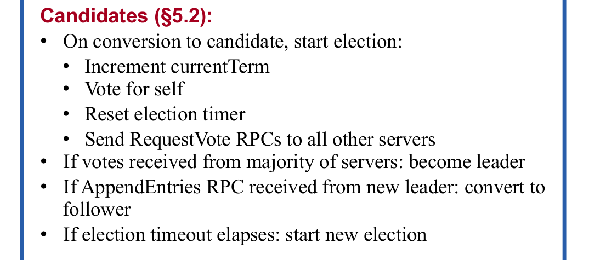

% Simulating the Raft Consensus Protocol
% Rex Fernando
% Dec 17, 2015

# Changes since Thursday:

* Added 4 new simulation outputs, with explanations:
    + A crash during log write, restart later
    + An example of a bad election that shouldn't happen
    + The correct behavior for the previous example
    + A temporary network partition

* Parts of Raft which I haven't implemented:
    + Log compaction
    + Cluster membership changes

# Goals

## Problem: Comparison of Raft and Paxos

* Behavior in edge cases
* Ease of implementing

# Proto-Goals

## Problem: Build a useful simulation framework

* Should be able to simulate Raft and Paxos
* For now, only Raft
* Goal: generality

# Solution/Outline

\ 

. . .

* Sampling of each piece
* Example Simulation Runs

# Event layer

* Input: sequence of events, handler, starting state
  - Handler: (State, Event) -> (Modified state, List of events to emit)
* Ouput: sequence of events, states ("filled out")

. . .

## Example

. . .

* Input
  - Events: \[ Switch on at time 0, Switch off at time 1 \]
  - Starting state: Light is off
  - Handler: 
    + If switch is switched on at time t, emit light-on event at t+0.01.
    + If switch is switched off at time t, emit light-off event at t+0.01.

. . .

* Output
  - Events: \[ Switch on at time 0, Light on at time 0.01, Switch off at time 1, Light off at time 1.01 \]

# Dist. System Layer

* System now consists of $n$ machines
* Input: 
  - Sequence of events
  - Handlers and starting states _for each machine in the system_
  - _Global system behavior description_
    + Network
    + Crashes
    + Input into the system
* Ouput: sequence of events, states

# Raft Layer

\ 

# Raft Layer

~~~~ {#mycode .haskell .numberLines}
-- Response handler
raftHandler (ReqVR term voteGranted) = do
  state <- get
  if term > (currentTerm state) then do
    becomeFollower term (-1)
    else if voteGranted then do
      put state { votesForMe = (votesForMe state)+1 }
      state <- get
      if (votesForMe state) >= quorum then
        becomeLeader
        else return ()
      else return ()
~~~~~~~~~~~~~~~~~~~~~~~~~~~~~~~~~~~~~~~~~~~~~~~~~

# Crash after Elect

~~~~ {#mycode .haskell .numberLines}
global (Event time (Receive _ leader  _ 
                   (AppE _ _ _ _ _ _))) ms = do
  alreadyCrashed <- get
  if not alreadyCrashed then do
    crash leader
    put True
    else return ()
  sendAllMessages time ms

sendAllMessages time ms = 
  mapM_ (flip send (time+delay)) ms
~~~~~~~~~~~~~~~~~~~~~~~~~~~~~~~~~~~~~~~~~~~~~~~~~

# Crash after Elect

\ 

# Crash after Elect 2

~~~~ {#mycode .haskell .numberLines}
global (Event time (Receive _ leader  _ 
                   (AppE _ _ _ _ _ _))) ms = do
  alreadyCrashed <- get
  if not alreadyCrashed then do
    crash leader
    --put True
    else return ()
  sendAllMessages time ms

sendAllMessages time ms = 
  mapM_ (flip send (time+delay)) ms
~~~~~~~~~~~~~~~~~~~~~~~~~~~~~~~~~~~~~~~~~~~~~~~~~

# Crash after Elect 2

\ 

# Crash During Log Write

\ 

# Crash During Log Write, Restart Later

This example is like the previous one, except that the server which
crashed restarts after a new leader has been elected. Before its
election timeout happens, it receives an AppendEntries RPC from the
current leader, so it becomes a follower. The AppendEntries RPC informs
it of a new log entry with the same index as the one it failed to
commit, so it replaces its own entry with the new one.

# Crash During Log Write, Restart Later

\ 

# Bad Election 

A machine determines whether it can vote for a candidate based on
whether it has already voted for someone in the relevant term. As
described in the Raft paper, it also must check whether the candidate's
log is as up to date as its own. This is because Raft is designed so
that log entries only flow from leaders to followers. If a leader is
elected without all the committed entries, these entries will be lost.
The next example demonstrates a bad election that could happen if this
criterion were not checked. The result is that a committed entry is
overwritten.

# Bad Election 

\ 

# Bad Election Fixed

We now show the same scenario except with the correct voting behavior in
place. The same machine attempts to elect itself but cannot, since its
log does not contain the latest committed entry. A machine with this
entry is subsequently elected. The new leader accepts a new log entry
and progagates it to all machines that are not crashed.

# Bad Election Fixed

\ 

# Network Partition

This example shows a network partition that happens right after the
first leader gets elected. Machines 1 (the leader) and 2 are separated
from machines 3, 4, and 5. Both partitions accept new log entries, but
the smaller partition does not commit since it does not have a quorum.
When the partition is fixed, the smaller partition's entries are
subsequently overwritten by the larger one.

# Network Partition

\ 

# Summary

## My Simulation framework allows you to:

* Describe a distributed system (in this case Raft)
* Give custom "global behavior"
* Visualize results

